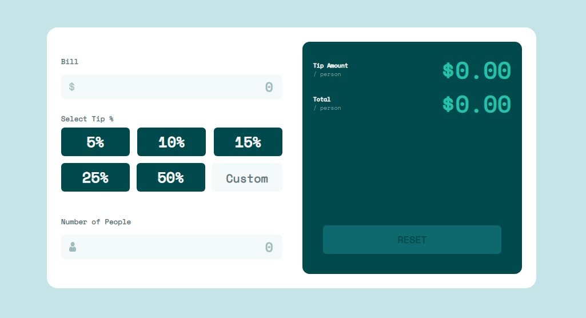

# Tip calculator app solution
This is a web application that can be used to split the total bill per company.

## Table of contents

- [Overview](#overview)
- [My process](#my-process)
  - [Built with](#built-with)
  - [What I learned](#what-i-learned)


## Overview





## My process

### Built with

- Semantic HTML5 markup
- CSS custom properties
- Flexbox
- CSS Grid


### What I learned

While I coded this project, I am got many practices in js. I learned addEventListener method and learned work with classList.

```js
customPercent.addEventListener('mouseenter', function () {
    if (!customPercent.classList.contains('border-error')) {
        customPercent.classList.add('border-focus');
    }
});

customPercent.addEventListener('mouseleave', function () {
    if (!customFocus) {
        customPercent.classList.remove('border-focus');
    }
});
```

